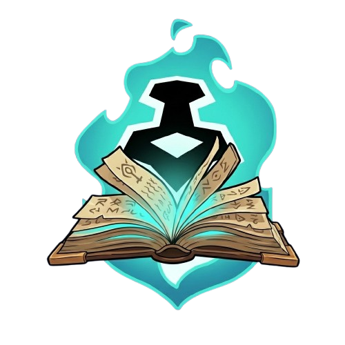
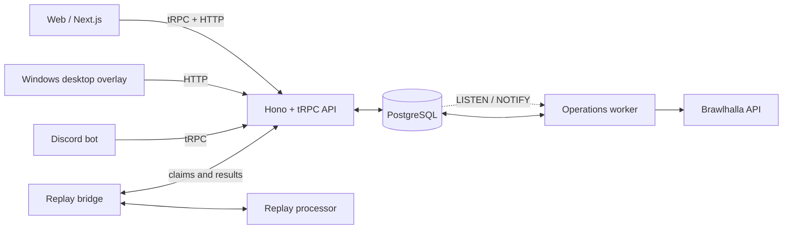

<p align="center">
  
</p>

<p align="center">
  Brawlhalla player tracking for stats, rankings, clans, rating history, and live opponent insights.
</p>

<p align="center">
  <a href="https://github.com/NickTacke/brawltome/actions/workflows/ci.yml"></a>
  <a href="LICENSE"></a>
</p>

<p align="center">
  <a href="https://brawltome.app">Web App</a> ·
  <a href="#discord-bot">Discord Bot</a> ·
  <a href="#desktop-overlay">Desktop Overlay</a>
</p>

## Features

- **Player profiles:** ranked stats, legends, weapons, and rating history
- **Leaderboards:** 1v1, 2v2, Solo 2v2, and 3v3 with region filters and pagination
- **Clans and discovery:** clan pages and searchable player aliases and former names
- **Discord bot:** slash commands for player, clan, and service information
- **Desktop overlay:** live Windows opponent detection and player insights
- **Durable refresh operations:** PostgreSQL-backed refresh, ranking, discovery, and projection work
- **Replay analysis preview:** backend replay processing coordinated through the replay bridge

## Architecture



- PostgreSQL owns durable operations, schedules, retries, dead letters, deduplication, and source quotas.
- The operations worker claims fenced leases and performs external Brawlhalla work at least once.
- `LISTEN`/`NOTIFY` improves wake-up latency; polling preserves recovery correctness.

### Technology

| Area | Technology |
| --- | --- |
| Runtime | Bun 1.3.14 |
| API | Hono 4 + tRPC 11 |
| Web | Next.js 16 + React 19 |
| Desktop | Tauri 2 |
| Discord | discord.js 14 |
| Data | PostgreSQL 16 + Drizzle ORM |
| UI | Tailwind CSS 4 + Radix-based shared components |
| Telemetry | OpenTelemetry |
| Tooling | Biome |

### Repository layout

| Path | Purpose |
| --- | --- |
| `apps/` | API and worker, web app, Discord bot, Windows desktop overlay, and replay bridge |
| `packages/contexts/` | Accounts, players, clans, rankings, discovery, refresh operations, replay analysis, and statistics capabilities |
| `packages/` | Database and Brawlhalla adapters, contracts, game data, telemetry, and shared UI |
| `infra/` | Application, observability, backup, storage, and host-service infrastructure with its checks |
| `tooling/` | Cross-repository architecture policy and database migration commands |

## Getting started

### Prerequisites

- [Bun](https://bun.sh/) 1.3.14
- [Docker](https://www.docker.com/) with Compose
- A Brawlhalla API key from [dev.brawlhalla.com](https://dev.brawlhalla.com/)
- Git submodule access only for optional desktop development

### Local setup

```bash
git clone https://github.com/NickTacke/brawltome.git
cd brawltome
bun install
cp .env.example .env
docker compose up -d
```

Set `BRAWLHALLA_API_KEY` in `.env`. Generate independent values for `INTERNAL_API_SECRET`, `REFRESH_TRUST_COOKIE_SECRET`, and `REPLAY_BRIDGE_SECRET`:

```bash
openssl rand -hex 32
```

Run migrations, then start the API, operations worker, and web app in separate terminals. The explicit ports keep the web app, worker health endpoint, and optional Discord metrics endpoint from colliding:

```bash
bun run db:migrate
PORT=3000 bun run dev:api
HEALTH_PORT=3003 bun run dev:operations-worker
PORT=3001 bun run dev:web
```

The API listens on <http://localhost:3000> and the web app on <http://localhost:3001>.

### Database commands

| Command | Purpose |
| --- | --- |
| `bun run db:generate` | Generate migration files while authoring schema changes |
| `bun run db:migrate` | Apply committed database migrations |
| `bun run db:push` | Push schema changes directly during local development |

## Discord Bot

Set `DISCORD_TOKEN` and an independently generated `DISCORD_INTERNAL_API_SECRET`. The bot and API must share both `DISCORD_INTERNAL_API_SECRET` and `INTERNAL_API_SECRET`. Set `DISCORD_CLIENT_ID` when registering slash commands or initializing application emojis.

```bash
bun run dev:discord-bot
```

## Desktop Overlay

Desktop development requires Windows. The detection submodule is private, so configure repository access before initializing it:

```bash
git submodule update --init --recursive
bun run dev:desktop
```

## Contributor checks

```bash
bun run lint
bun run typecheck
bun test
bun run architecture:check
bun run infra:app:check
bun run infra:observability:check
```

## Deployment

The root multi-stage `Dockerfile` builds the deployable images. Production application infrastructure and its checks live in `infra/app`; observability infrastructure lives in `infra/observability`.

## License

BrawlTome is licensed under the [GNU General Public License v3.0](LICENSE).
