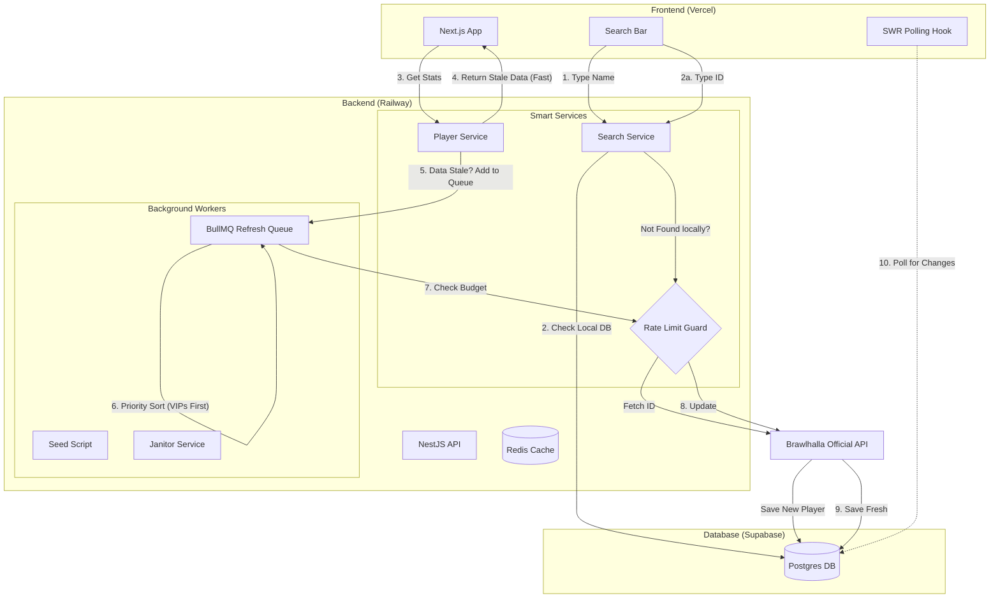

# ⚔️ brawltome.app - Implementation Plan

## 1. Project Overview
A high-performance player statistics tracker for Brawlhalla designed to operate within a strict API rate limit (180 requests/15 mins). It uses an "Economy-based" architecture, prioritizing aggressive caching, background synchronization, and popularity-based queuing to ensure scalability.

### Core Stack
*   **Monorepo:** Nx
*   **Frontend:** Next.js (hosted on Vercel)
*   **Backend:** NestJS (hosted on Railway)
*   **Database:** Postgres (Supabase)
*   **Queue/Cache:** Redis (Railway)

---

## 2. Architecture Diagram

---

## 3. The "Scarcity Economy" Rules
*Every feature must check the API "Budget" before executing.*

| Component | Trigger | Priority | Budget Check |
| :--- | :--- | :--- | :--- |
| **ID Search** | User searches specific ID | **High** | Fail if tokens < 50 |
| **Profile Load** | User visits Profile URL | **Critical** | Always return DB data. Queue refresh. |
| **Refresh Worker** | Background Queue | **Variable** | **VIP System:** High view counts = Priority 1. |
| **Janitor** | Cron (Every 1m) | **Low** | Only run if tokens > 100 (Idle). |

---

## 4. Completed Phases ✅

### Phase 1: Nx Monorepo Initialization
- [x] Create Workspace (`@nx/next`, `@nx/nest`)
- [x] Install Core Deps (Prisma, BullMQ, Bottleneck, Axios)

### Phase 2: Shared Libraries & Database
- [x] Create `libs/bhapi-client` (The Gatekeeper)
- [x] Create `libs/database` (Prisma)
- [x] Define Schema (Player, Stats, Ranked, Clan, Legend)

### Phase 3: The Seeder
- [x] Create `apps/api/src/seed.ts`
- [x] Implement crawler for global rankings (Pages 1-200)

### Phase 4: API & "Smart Queue" Logic
- [x] Queue Setup (BullMQ)
- [x] Player Service (Stale-While-Revalidate pattern)
- [x] Refresh Processor (Token-aware worker)
- [x] Janitor Service (Idle maintenance)

### Phase 5: Frontend Development
- [x] Search Component (Local Name search + ID lookup)
- [x] Profile Page (Live updates with SWR)
- [x] Leaderboards (Filter by Region/Sort)
- [x] Clan Support (Profile & Members)
- [x] Server Status Widget

---

## 5. Deployment Guide (Next Steps 🚀)

### Backend (Railway)
1.  **New Service:** GitHub Repo.
2.  **Variables:**
    *   `DATABASE_URL`: `postgres://...` (Supabase)
    *   `REDIS_URL`: `${{Redis.REDIS_URL}}` (Railway Reference)
    *   `BRAWLHALLA_API_KEY`: `...`
3.  **Build/Start:**
    *   Build: `npx nx build api`
    *   Start: `node dist/apps/api/main.js`

### Frontend (Vercel)
1.  **Import Repo.**
2.  **Framework:** Next.js.
3.  **Build Command:** `npx nx build web`
4.  **Output:** `dist/apps/web/.next`
5.  **Variables:**
    *   `NEXT_PUBLIC_API_URL`: `https://[your-railway-url].up.railway.app`

---

## 6. Roadmap & Future Features 🔮

### Phase 6: Analytics & Optimization
- [ ] **Redis Response Caching:** Cache `GET /player/:id` responses for 60s to reduce DB hits during viral spikes.
- [ ] **PostHog Integration:** Track "Search Misses" to improve seeding strategy.
- [ ] **Sentry:** Error tracking for background workers.

### Phase 7: Advanced Features
- [ ] **ELO History Charts:** 
    *   Create `PlayerRankedHistory` table.
    *   Snapshot ELO daily via Janitor.
    *   Visualize with Recharts.
- [ ] **Twitch Integration:**
    *   Allow streamers to "claim" their profile.
    *   Show "Live Now" badge on profile if streaming.
- [ ] **Discord Bot:**
    *   `/stats [name]` command reusing `bhapi-client`.
    *   Webhook alerts for clan changes.
- [ ] **Mobile App:**
    *   Capacitor or React Native wrapper for the web view.

### Phase 8: "The Meta" (Global Analytics)
- [ ] **Legend Tier Lists:**
    *   Aggregate `PlayerRankedLegend` data from top 1000 players.
    *   Calculate Win Rates & Pick Rates per legend.
    *   Generate automatic Tier List (S/A/B/C) based on data.
- [ ] **Weapon Analysis:**
    *   Derive weapon performance by aggregating stats of legends sharing weapons.

### Phase 9: Community & Social
- [ ] **Claim Profile:**
    *   Verify ownership via Steam/Ubisoft OAuth.
    *   Custom banners/badges for verified users.
- [ ] **Rivalries:**
    *   "Head-to-Head" comparison tool (Player A vs Player B).
    *   Clan vs Clan stat battles.

### Phase 10: Esports
- [ ] **Tournament Integration:**
    *   Start.gg API integration.
    *   Show "Recent Tournament Results" on player profiles.
    *   "Pro Player" verification badge for Top 8 finishers.
