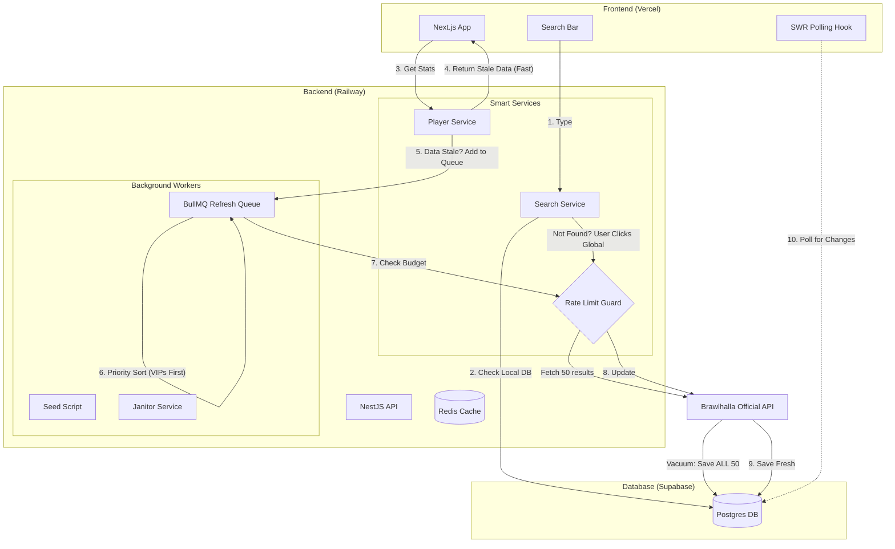

# ⚔️ brawltome.app - Implementation Plan

## 1. Project Overview
A high-performance player statistics tracker for Brawlhalla designed to operate within a strict API rate limit (180 requests/15 mins). It uses an "Economy-based" architecture, prioritizing aggressive caching, background synchronization, and popularity-based queuing to ensure scalability.

### Core Stack
*   **Monorepo:** Nx
*   **Frontend:** Next.js (hosted on Vercel)
*   **Backend:** NestJS (hosted on Railway)
*   **Database:** Postgres (Supabase)
*   **Queue/Cache:** Redis (Railway)

---

## 2. Architecture Diagram



---

## 3. The "Scarcity Economy" Rules
*Every feature must check the API "Budget" before executing.*

| Component | Trigger | Priority | Budget Check |
| :--- | :--- | :--- | :--- |
| **Global Search** | User clicks "Search Official Servers" | **High** | Fail if tokens < 10 |
| **Profile Load** | User visits Profile URL | **Critical** | Always return DB data. Queue refresh. |
| **Refresh Worker** | Background Queue | **Variable** | **VIP System:** High view counts = Priority 1. |
| **Janitor** | Cron (Every 1m) | **Low** | Only run if tokens > 140 (Idle). |

---

## 4. Implementation Steps

### Phase 0: Infrastructure Setup
*Do this before writing a single line of code.*

1.  **Supabase:**
    *   Create Project.
    *   Go to *Settings > Database* and copy `Connection String` (Use Transaction Mode port 6543).
2.  **Railway:**
    *   Create Project.
    *   Right Click -> Add Service -> **Redis**.
    *   Copy the `REDIS_URL` from the *Connect* tab.
3.  **Brawlhalla:**
    *   Register for your API Key.

### Phase 1: Nx Monorepo Initialization
1.  **Create Workspace:**
    ```bash
    npx create-nx-workspace@latest brawlhalla-stats --preset=next
    cd brawlhalla-stats
    ```
2.  **Add Backend:**
    ```bash
    npm install -D @nx/nest
    npx nx g @nx/nest:app api
    ```
3.  **Install Core Deps:**
    ```bash
    npm install @prisma/client bottleneck bullmq @nestjs/bullmq @nestjs/config ioredis swr axios clsx tailwind-merge
    npm install -D prisma
    ```

### Phase 2: Shared Libraries & Database
1.  **Create Libs:**
    *   `libs/brawlhalla-client`: Wraps axios + `bottleneck` (The Gatekeeper).
    *   `libs/database`: Holds Prisma schema and client.
2.  **Prisma Schema (`libs/database/prisma/schema.prisma`):**
    ```prisma
    model Player {
      brawlhallaId Int      @id
      name         String
      rating       Int      @default(0)
      tier         String?
      wins         Int      @default(0)
      viewCount    Int      @default(0)  // For VIP Priority
      lastUpdated  DateTime @default(now())
      lastViewedAt DateTime @default(now())

      @@index([name]) // Critical for local search
    }
    ```
3.  **The Gatekeeper (`libs/brawlhalla-client`):**
    *   Initialize `Bottleneck` with `reservoir: 180` and `reservoirRefreshInterval: 15 * 60 * 1000`.
    *   Set `datastore: 'redis'` to allow scaling on Railway.

### Phase 3: The Seeder (Pre-Launch)
*We need to pre-fill the database so early users don't hit the API limit.*

1.  Create `apps/api/src/console/seed.ts`.
2.  Write a script that:
    *   Loops Regions: `US-E`, `EU`, `BRZ`, etc.
    *   Loops Pages: `1` to `200`.
    *   Upserts every player found into Postgres.
3.  Run this locally pointing to your Supabase DB for 24-48 hours.

### Phase 4: API & "Smart Queue" Logic
1.  **Queue Setup:**
    *   Register `BullModule` in `app.module.ts`.
2.  **Player Service (`getPlayer`):**
    *   Fetch from DB.
    *   Return immediately.
    *   Calculate Priority: `Max(1, 100 - sqrt(viewCount))`.
    *   Add to Queue: `refreshQueue.add('refresh', { id }, { priority, jobId: ... })`.
3.  **Refresh Processor:**
    *   Check `gatekeeper.getRemainingTokens()`.
    *   If `< 20`, **Abort** (Save tokens for new user searches).
    *   Else, Fetch API -> Update DB.

### Phase 5: Frontend Development
1.  **Search Component:**
    *   `input onChange`: Calls `/api/search/local`.
    *   If `results.length === 0`: Show button *"Search Global Servers"*.
    *   Button Click: Calls `/api/search/global` (The Vacuum).
2.  **Profile Page:**
    *   Use SWR: `useSWR('/api/player/123', { refreshInterval: data?.isRefreshing ? 5000 : 0 })`.
    *   Show "Updating..." spinner when `isRefreshing` is true.

---

## 5. Deployment Guide

### Backend (Railway)
1.  **New Service:** GitHub Repo.
2.  **Variables:**
    *   `DATABASE_URL`: `postgres://...` (Supabase)
    *   `REDIS_URL`: `${{Redis.REDIS_URL}}` (Railway Reference)
    *   `BRAWLHALLA_API_KEY`: `...`
3.  **Build/Start:**
    *   Build: `npx nx build api`
    *   Start: `node dist/apps/api/main.js`

### Frontend (Vercel)
1.  **Import Repo.**
2.  **Framework:** Next.js.
3.  **Build Command:** `npx nx build web` (or leave default if Nx plugin is detected).
4.  **Output:** `dist/apps/web/.next`.
5.  **Variables:**
    *   `NEXT_PUBLIC_API_URL`: `https://[your-railway-url].up.railway.app`

---

## 6. Checklist for Launch 🚀

- [ ] **Database Seeded:** Have at least 200k players indexed.
- [ ] **Rate Limiter Tested:** Verify `bottleneck` pauses after 180 requests locally.
- [ ] **Vacuum Tested:** Confirm global search saves *all* 50 results, not just one.
- [ ] **Priority Queue:** Verify "Sandstorm" (simulated high view count) cuts the line.
- [ ] **Janitor:** Confirm it only runs when tokens > 140.
- [ ] **Footer:** Add "Server Status" widget to UI (Green/Yellow/Red).